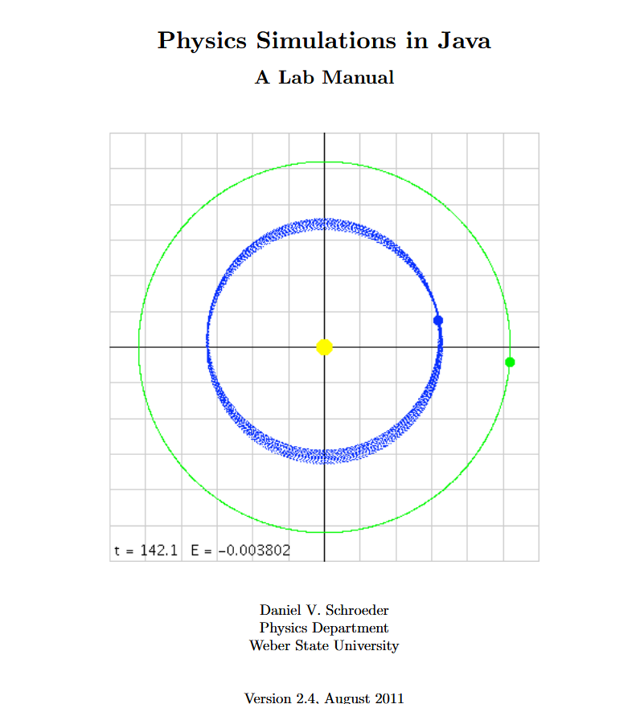

# Physics Simulations in Java – A Lab Manual

  
 

## Projects

| Project # | Title                        | Folder Name              |
| --------: | :--------------------------- | :----------------------- |
|         1 | Hello, World!                | [`1-HelloWorld/`](1-HelloWorld/README.md)                    |
|         2 | Range of a Projectile        | [`2-ProjectileRange/`](2-ProjectileRange/README.md)          |
|         3 | Adding Sine Waves            | [`3-AddingSineWaves/`](3-AddingSineWaves/README.md)          |
|         4 | Simulating Projectile Motion | [`4-ProjectileMotion/`](4-ProjectileMotion/README.md)        |
|         5 | Pendulum                     | [`5-Pendulum/`](5-Pendulum/README.md)                        |
|         6 | Orbits                       | [`6-Orbits/`](6-Orbits/README.md)                            |
|         7 | Molecular Dynamics           | [`7-MolecularDynamics/`](7-MolecularDynamics/README.md)      |
|         8 | Random Processes             | [`8-RandomProcesses/`](8-RandomProcesses/README.md)          |
|         9 | The Ising Model              | [`9-IsingModel/`](9-IsingModel/README.md)                    |
|        10 | Independent Project          | [`10-Project/`](10-Project/README.md)                        |
